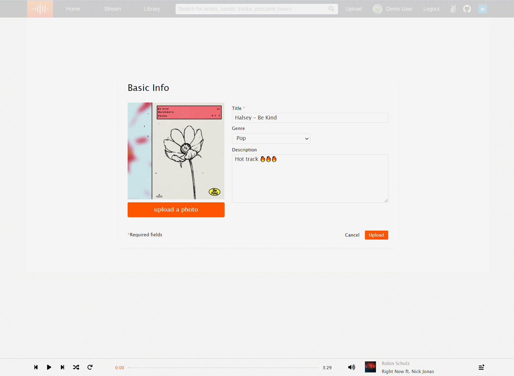
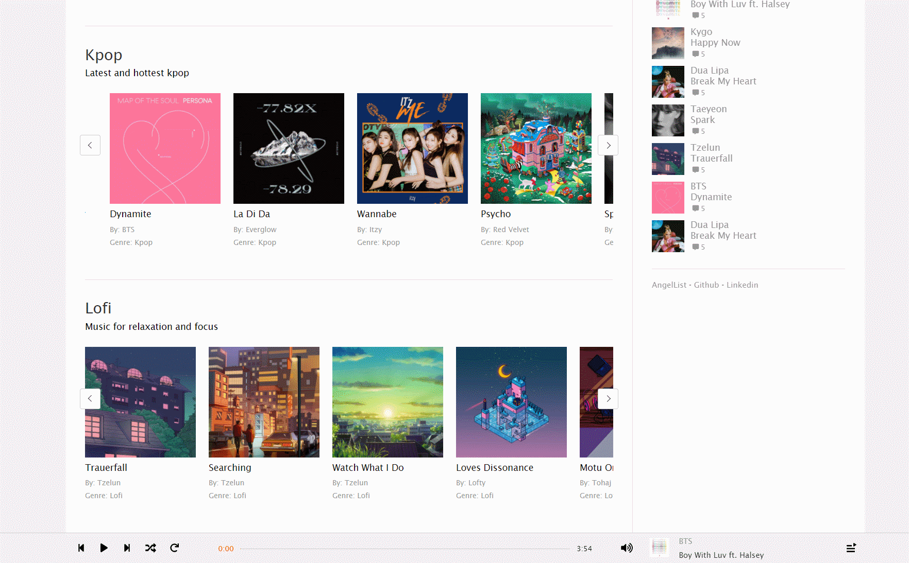

# SoundClout

[Live Site](https://kenny-fsp.herokuapp.com/#/)

## Description

SoundClout is a SoundCloud clone. An online music sharing platform that allows users to upload and listen to music uploaded to the site. Users can upload music, leave comments, or 
put their favorite hits on repeat.

## Technologies
* Ruby on Rails
* Javascript
* React Redux
* AWS
* HTML/CSS

## Features

### Login/Signup
* Users can login to an existing account or they can create an account by filling out the login or sign up forms.

### Music Player
* Users can play tracks and navigate through the site with continuous play.
* Audio playback can be controlled by the media buttons located at the playbar footer. Users can play, pause, mute, adjust volume, loop, shuffle, and skip tracks.
* Volume swells when resuming and pausing tracks for a great user experience. Resuming and pausing a track does not immediately bring back or stop the volume. Resuming gradually brings the volume back up
and pausing a track will gradually lower the volume to 0.

### Persisting State
* A user's listening history, current track, and current playlist all persist on refresh for a good user experience. All information about a user's playback persist when a user signs back in as well.

### Track CRUD
* Users can upload audio to the site. After uploading the user is redirected to the show page of their new track.
* (Optional) Attaching an image to the track displays a preview of the image.
* After a track is uploaded a user can edit details about their track. User's can also change the photo that is attached to the track.

### Playlist
* A playlist based on genre gets generated when a user plays a track. Users can view their playlist by clicking on the hamburger icon on the right most side of the playbar.
* A user can change the playlist by first clicking the `Clear` button on the playlist header then selecting a new track.
* Clicking the back button on the playbar plays the previously played track and queues the current track to the playlist.

### Comments
* Users can interact with other user's creations by leaving comments on their tracks.
* Users can delete their own comments as well as comments on any of their uploaded tracks.

### Listening History
* Previously played tracks are saved in to user's listening history.
* Clicking the back button on the playbar plays past tracks that the user listened to 
* Previously played tracks can be traversed by using the skip and forward buttons on the playbar footer

## Future Features
* Search feature
* Drag and drop uploading
* Improved playlist functionality
* Audio waveforms